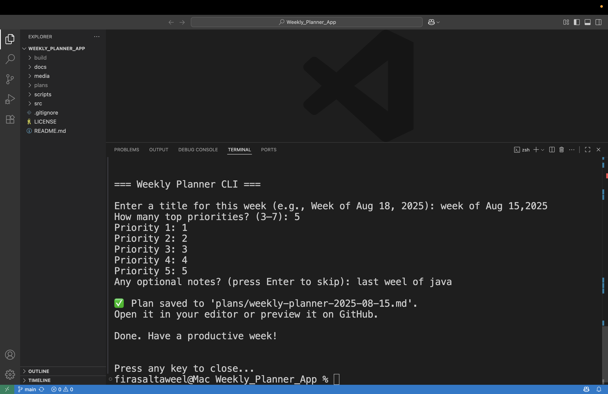

# Weekly Planner CLI (Java)

A tiny terminal app that gathers your top 3–7 priorities and generates a polished Markdown weekly plan you can track in Git and share on GitHub. **Pure Java CLI** (no web/GUI).

## ✨ Features
- Asks for 3–7 weekly priorities + optional notes
- Saves a dated Markdown file in `plans/`
- Works from terminal or by **double‑clicking** the run scripts

## 🛠️ Requirements
- Java 17+
- Git (to push to GitHub)

> Gradle files are not required. Scripts compile & run using `javac`/`java` directly.

## 🔧 Install (local)
```bash
# if you downloaded the zip
cd Weekly_Planner_App
```

## ▶️ Run (no Gradle needed)
### macOS / Linux
```bash
# make the script executable once
chmod +x scripts/run_mac.command scripts/run_linux.sh

# then run
scripts/run_mac.command
# or
scripts/run_linux.sh
```

### Windows
Double‑click `scripts\run_windows.bat` or run in PowerShell:
```powershell
scripts\run_windows.bat
```

After running, check the `plans/` folder for a new Markdown file like:
```
plans/weekly-planner-2025-08-18.md
```

## 📷 Screenshot & 🎥 Demo
Add at least one screenshot of your terminal running the app to `media/screenshot.png` and update this section:



[🎥 Watch Demo](media/demo.mp4)


## 📚 Wiki
Draft pages live in `docs/wiki` for convenience; copy them into your repo's **Wiki tab** on GitHub.

## 📜 License
MIT
